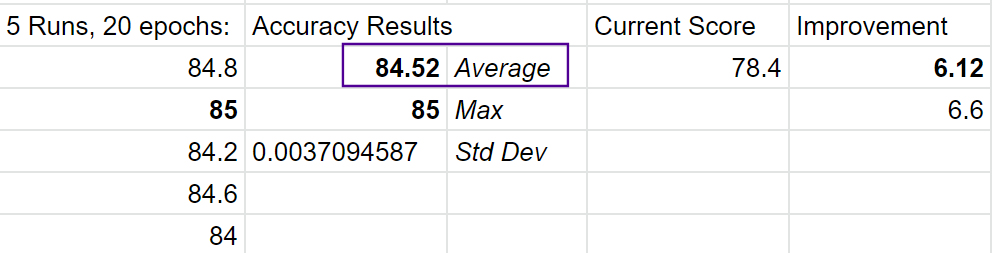
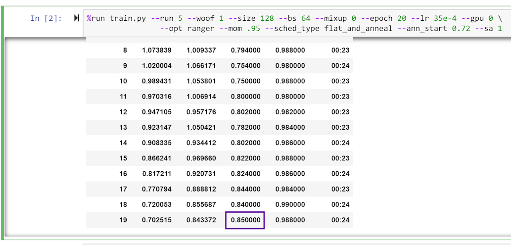
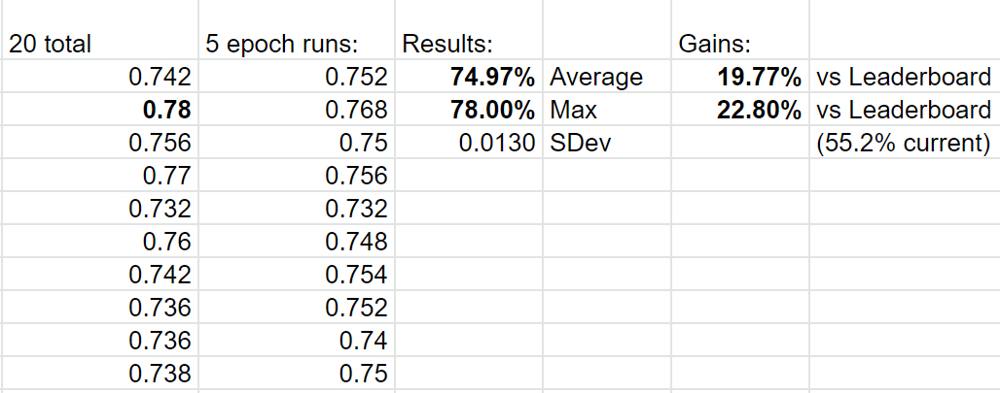
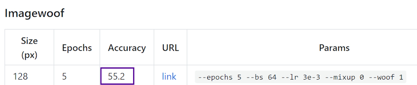
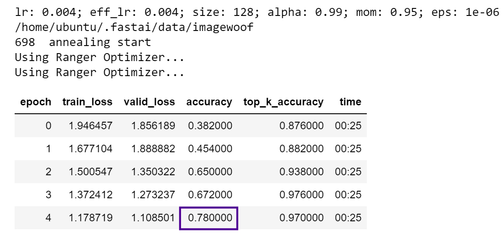
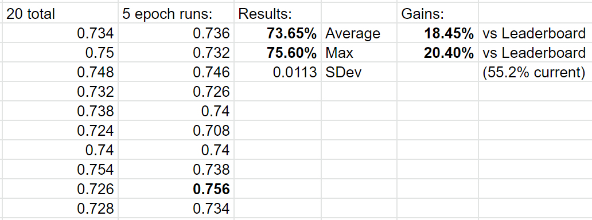
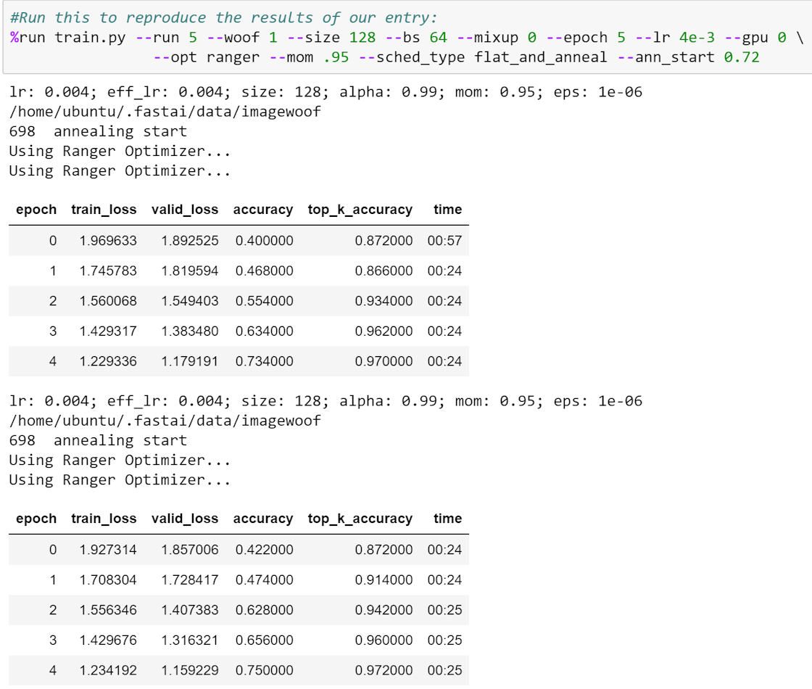

# Ranger-Mish-ImageWoof-5
Repo for letting users reproduce the record-setting new RangerMish+Self Attention combo on FastAI Leaderboards - ImageWoof dataset 5 epochs and 20 epochs, 128px.

Contributors to this effort - FastAI board names:
@LessW2020 / @muellerzr / @Seb / @grankin / @Redknight / @oguiza

We have established a total of 12 new 5 epoch and 20 epoch records using this setup.  

Here's the new 20 epoch results...almost identical parameters as the record 5 epoch setup, just a tiny drop in learning rate:

and screenshot of the max high run:

Two variations - with and without self attention.  
Both setups set new records for 5 epoch training on ImageWoof (same day).

The highest scores are with @Sebs self attention layer - this is controlled by the --sa 1 param in the training script:

and current leaderboard:

details of an exceptional peak score:

You can run the notebook with the Self Attention layer as follows:

Below are the results without attention layer (--sa 0, which is default).

## How to use:  
Just launch the training script - the script references more optimizers, etc. than what is in this repro so stick with --opt ranger for the optimizer.  Here's an example:

and link to the leaderboards:
https://github.com/fastai/imagenette

and FastAI forum link:
https://forums.fast.ai/t/meet-mish-new-activation-function-possible-successor-to-relu/53299

## Reference Links:
Mish activation, official links:
Mish github - https://github.com/digantamisra98/Mish  
Mish paper - https://arxiv.org/abs/1908.08681. 

More links coming.  
